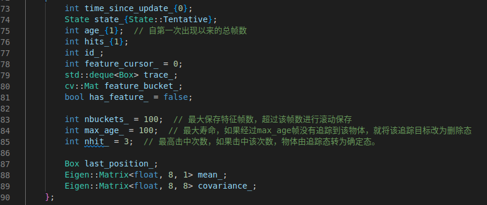
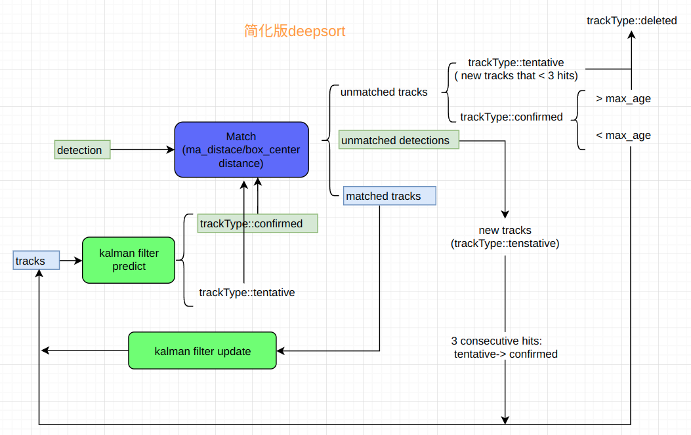
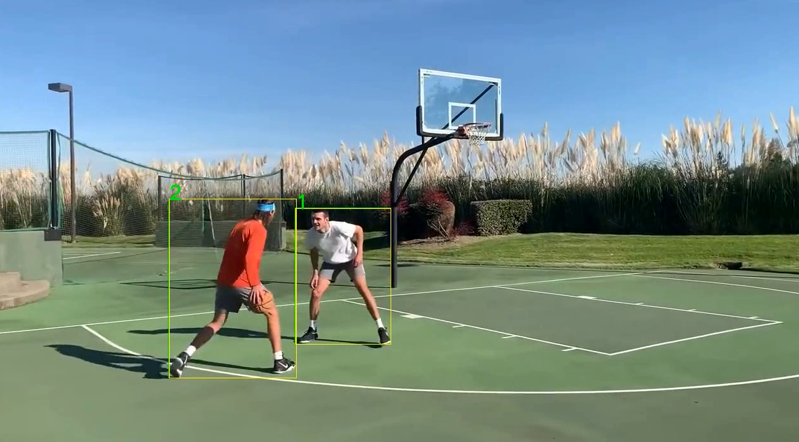
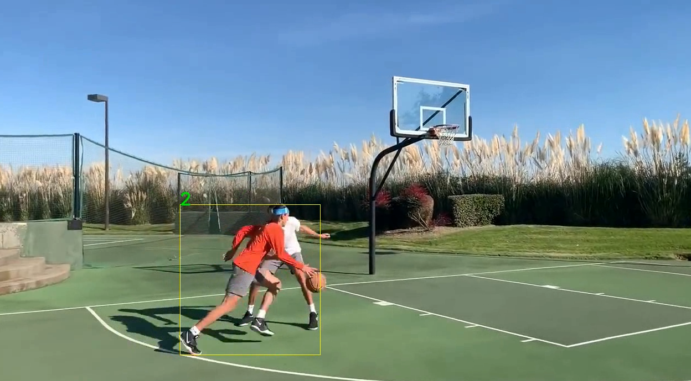
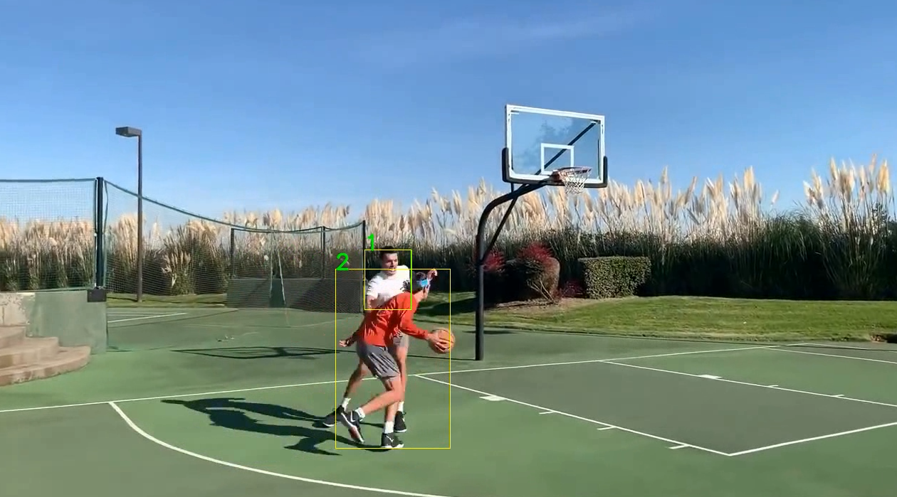

# 代码分析

源自项目：https://github.com/shouxieai/tensorRT_Pro
本项目对其中目标跟踪部分进行代码注释和分析

# 运行

## 目标跟踪

### pipeline of simple deepsort

file: src/application/app_fall_recognize.cpp

**跟踪类**中一般仅保存卡尔曼过程的状态变量和状态过程协方差矩阵，还有跟踪的相关参数，如下：

### 目标跟踪效果

1. 目标跟踪正常
   
2. 目标1因遮挡而消失
   
3. 目标1出现继续跟踪
   

### 卡尔曼滤波效果

绿色：当前检测框
红色：预测框

