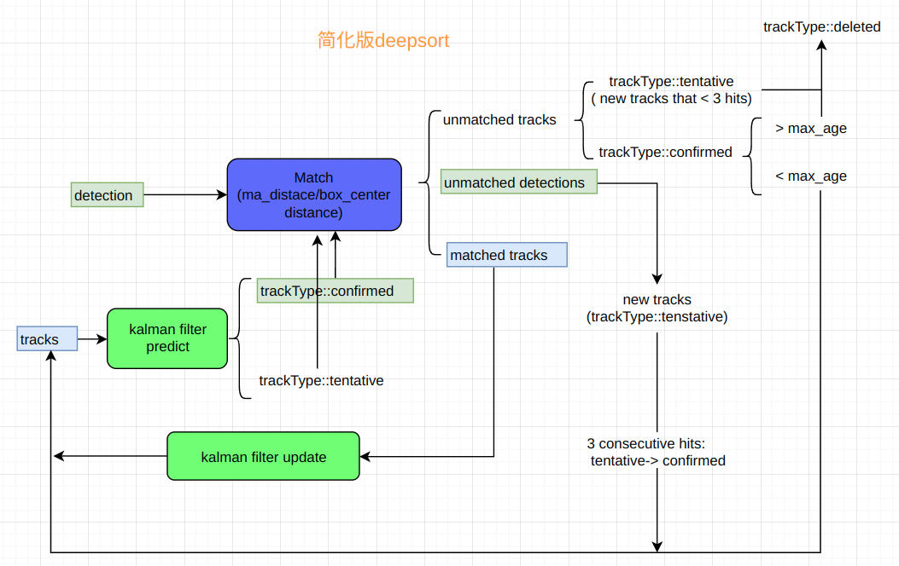

# 代码分析
源自项目：https://github.com/shouxieai/tensorRT_Pro  
本项目对其中目标跟踪部分进行代码注释和分析
## 目标跟踪
### pipeline of simple deepsort 

### 目标跟踪效果

1. 目标跟踪正常

2. 目标1因遮挡而消失

3. 目标1出现继续跟踪

### 卡尔曼滤波效果
绿色：当前检测框  
红色：预测框
